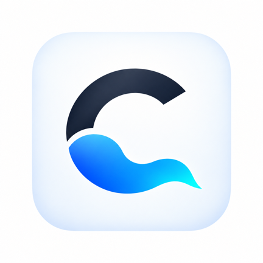

# Cloudiste

<p align="center">
  
</p>

Cloudiste est un front-end Android pensé pour le cloud gaming, les jeux Android et les émulateurs. Il peut être utilisé comme une application classique ou comme launcher Android facultatif. Cette page distribue les versions bêta officielles avant leur disponibilité sur Google Play.

## Documentation

- [Découvrir Cloudiste](docs/README.md)
- [Installation et mises à jour](docs/INSTALLATION.md)
- [Guide utilisateur](docs/GUIDE-UTILISATEUR.md)
- [Commandes tactiles et manette](docs/COMMANDES.md)
- [Sauvegarde, diagnostic et dépannage](docs/SAUVEGARDE-ET-DIAGNOSTIC.md)
- [Historique des mises à jour](CHANGELOG.md)
- [Participer à la bêta](CONTRIBUTING.md)

## Installer Cloudiste

1. Ouvrez la page [Releases](https://github.com/Cloudiste/Cloudiste-Releases/releases/latest).
2. Téléchargez le fichier nommé `Cloudiste-…-release.apk`.
3. Autorisez votre navigateur à installer cette application si Android le demande.
4. Ouvrez l’APK et suivez les indications d’Android.

Téléchargez uniquement les APK publiés sur ce dépôt officiel.

## Recevoir les mises à jour avec Obtainium

1. Installez [Obtainium](https://github.com/ImranR98/Obtainium/releases).
2. Dans Obtainium, choisissez **Ajouter une application**.
3. Collez l’adresse de ce dépôt :

   `https://github.com/Cloudiste/Cloudiste-Releases`

4. Si plusieurs fichiers sont proposés, sélectionnez l’APK correspondant à cette expression :

   `^Cloudiste-.*-release\.apk$`

5. Activez les notifications de mise à jour.

Obtainium vérifiera les nouvelles Releases GitHub. Android pourra encore demander une confirmation avant l’installation d’une mise à jour.

## Vérifier un téléchargement

Chaque Release contient un fichier `.sha256`. Pour vérifier un APK sur macOS ou Linux :

```bash
shasum -a 256 Cloudiste-0.54.0-release.apk
```

L’empreinte obtenue doit être identique à celle du fichier `.sha256` associé.

Certificat utilisé pour signer les versions bêta :

```text
SHA-256 : 0A:92:D9:A3:0B:FB:E1:0A:E8:4E:D6:8A:A7:B3:18:CB:9A:62:5C:48:C4:27:77:2B:CD:2A:4E:CF:F2:32:7F:FD
```

## Confidentialité et contact

- [Politique de confidentialité](https://cloudiste.github.io/Cloudiste-Releases/privacy/)
- Initiative et vibe coding : Rodolphe CHOUTEAU, chaîne **@Cloudgamingfrance**
- Soutenir le projet : [Ko-fi](https://ko-fi.com/rodolphecgf)

Les retours de la bêta sont les bienvenus dans l’espace Discord consacré à Cloudiste.

## État du projet

Cloudiste est actuellement distribué en bêta. La version la plus récente est indiquée dans la section [Releases](https://github.com/Cloudiste/Cloudiste-Releases/releases/latest). L’application n’est pas encore proposée publiquement sur Google Play.
